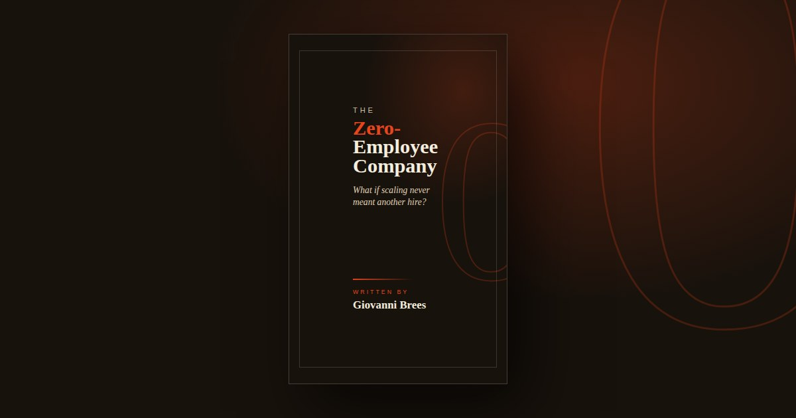

# The Zero-Employee Company

**The official website for _The Zero-Employee Company_, the book by [Giovanni Brees](https://giovannibrees.com) on building and scaling a one-person business with AI agents instead of employees.**

**Website:** [thezeroemployeecompany.com](https://thezeroemployeecompany.com) · **Get the book:** [Amazon](https://www.amazon.com/dp/B0H72KCZ6Y)

## About the book

What if scaling never meant another hire? _The Zero-Employee Company_ is the operating model for founders and solopreneurs who replace headcount with workflows, AI agent orchestration, and memory - and keep the judgment that still needs a human.

Giovanni Brees spent fifteen years bringing over 4,500 products to market and helping raise more than half a billion dollars. Then he exited and built what came next around one rule: no employees. Today he runs several companies - KentoHQ, Meet Oscar, and CiteEngine - on systems and a couple dozen AI agents he designed, wired together, and watches over himself.

The book covers: AI agents as roles (not tools), the delegation ladder, agent memory and the second brain, orchestration without a manager, trust-but-verify workflows, failure modes honestly labeled, and what the leverage actually buys.

## About this repository

True to the book's thesis, this website was built and deployed by an AI agent - from the design handoff to the Cloudflare Pages deployment, including this README.

It is a zero-build static site: one HTML file with inlined styles, structured data (Book, Person, FAQPage), an author photo, and a social share image. No framework, no build step, no JavaScript except a click-to-reveal contact email.

| File | Purpose |
|---|---|
| `index.html` | The complete site |
| `assets/` | Author photo and 1200x630 social share image |
| `404.html` | Not-found page |
| `robots.txt`, `sitemap.xml` | Search engine indexing |
| `_headers` | Security and cache headers for Cloudflare Pages |

Deployment: Cloudflare Pages, connected to this repository. Framework preset None, no build command, output directory `/`. Every push to the production branch deploys automatically.

## Copyright

Copyright (c) 2026 Giovanni Brees. All rights reserved. This repository is public for transparency and reference; no license is granted to copy, modify, or reuse its contents. See [LICENSE](LICENSE).
